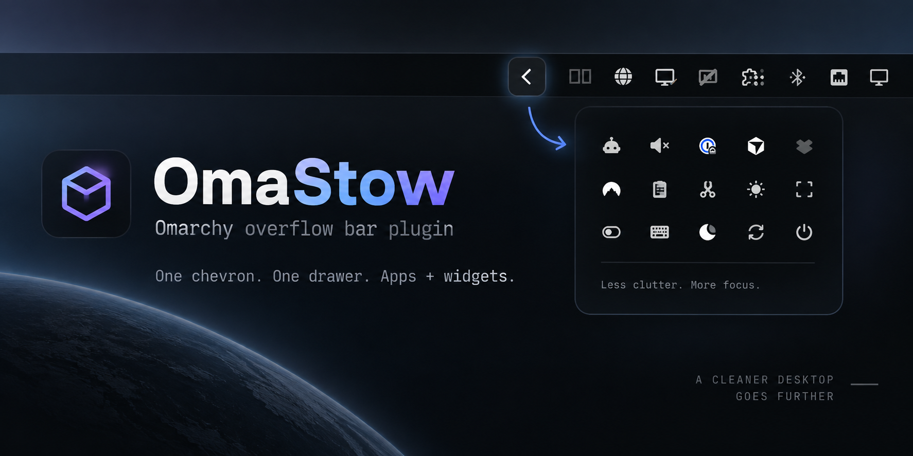

# OmaStow

Put the bar widgets you rarely click behind the tray chevron, and get them back with a hover.

OmaStow is a replacement for the Omarchy bar. It is the stock bar with one addition. Any widget in `bar.layout` can carry `overflow: true`, and every widget that does moves into the same drawer the tray already uses for unpinned apps. One chevron, one drawer, apps and widgets side by side. The bar stays one strip at one height.

Collapsed:


Open:


Everything else is the bar you have now. Your `shell.json` layout, your widgets, your theme, the drag-to-reorder gestures, `omarchy bar` and `omarchy toggle bar` all keep working. OmaStow reads the same config file the built-in bar reads and adds one key to it.

## What it does

- **One drawer for apps and widgets.** The tray chevron opens a drawer that holds every widget flagged `overflow: true` next to the chevron, then the unpinned tray apps. Pinned tray apps stay on the bar as before.
- **Reveal like the tray.** Hover the chevron and the drawer slides open. Move away and it closes. Click the chevron to hold it open, click again to let it go. Right-click the chevron for the tray **Manage** popup, where you pin and unpin apps.
- **Drag in, drag out.** Drag a widget onto the chevron, or next to a widget already in the drawer, and it lands there. Drag it back onto the bar and it leaves. The move edits `overflow` on that entry in `shell.json`, so the result survives a restart.
- **Popups hold the drawer open.** Open a panel from a widget in the drawer and the drawer stays open until the panel closes. The drawer opens at once in that case instead of sliding, so the panel does not chase a moving widget.
- **A keybinding.** `omarchy shell dmalmq.omastow toggleOverflow` opens and closes the drawer, so you can bind it in Hyprland.
- **Every orientation.** Top, bottom, left, and right bars. The drawer docks on the inner side of the section that holds `omarchy.tray`, so it opens toward the middle of the bar. On a left-section tray the whole drawer mirrors.
- **Nothing to configure.** No settings, no daemon, no service. If there are no tray apps and no overflowed widgets, the chevron is not drawn.

## Install

```bash
omarchy plugin add https://github.com/dmalmq/OmaStow --enable
```

`--enable` sets `bar.id` to `dmalmq.omastow` in `~/.config/omarchy/shell.json`. The shell swaps the bar in place. There is no automatic fallback: a bar plugin that throws while loading leaves the bar blank rather than reverting to `omarchy.bar`. If OmaStow ever fails to load, recover with `omarchy bar use built-in` (or edit `bar.id` back by hand) and `omarchy restart shell`.

Enable it later, or switch back and forth:

```bash
omarchy bar use dmalmq.omastow
omarchy bar use built-in
```

Requires Omarchy 4, which is where `omarchy-shell` and bar plugins arrived. OmaStow is a `kind: bar` plugin, and the shell runs one bar at a time, so enabling it disables `omarchy.bar`.

## Put a widget in the drawer

Three ways, all writing the same key.

Drag it. Grab the widget, drop it on the chevron. Drop it on the bar to take it out again, and it lands where you dropped it.

From the terminal:

```bash
omarchy bar set omarchy.agents overflow true --json
omarchy bar set omarchy.agents overflow false --json
```

`omarchy bar set` needs the layout entry to be an object. `omarchy plugin enable` writes objects, so this is the common case. If you wrote a bare `"omarchy.agents"` string into the layout by hand, write the object instead.

Or edit `~/.config/omarchy/shell.json`. Any entry in `left`, `center`, or `right` can carry the flag:

```json
{
  "bar": {
    "layout": {
      "right": [
        { "id": "omarchy.agents", "overflow": true },
        { "id": "omarchy.audio", "overflow": true },
        { "id": "omarchy.network" },
        { "id": "omarchy.tray" },
        { "id": "omarchy.power" }
      ]
    }
  }
}
```

The flag is the only change. The widget keeps its section and its place in that section's list, so the drawer shows left, center, and right widgets in layout order.

## Open it from the keyboard

Add this to `~/.config/hypr/bindings.lua`:

```lua
  o.bind("SUPER + SHIFT + O", "Overflow drawer", "omarchy shell dmalmq.omastow toggleOverflow")
```

The target is `dmalmq.omastow`, not `shell`. `omarchy shell shell call` reaches panels, overlays, and menus, and the bar is none of those, so OmaStow registers its own IPC target on the bar window. The same command works from a script:

```bash
omarchy shell dmalmq.omastow toggleOverflow
```

## Widgets

OmaStow is the packaged bar with the drawer added, so a widget that works on the built-in bar works here. The table is what has been checked live on this machine, not a promise about every widget.

| Widget | On the bar | Popup |
|---|---|---|
| `omarchy.menu`, `omarchy.workspaces`, `omarchy.clock`, `omarchy.indicators`, `omarchy.keyboard-layout`, `omarchy.weather`, `omarchy.system-update`, `omarchy.tray`, `omarchy.agents`, `omarchy.tailscale`, `omarchy.monitor` | yes | not checked |
| `omarchy.audio`, `omarchy.network`, `omarchy.bluetooth` | yes | yes |
| `omarchy.power` | yes | `shell summon omarchy.power` returns `ok` and no panel appears |
| `omarchy.media` | hidden while nothing plays, as on the built-in bar | not checked, no MPRIS player on the test machine |
| Third-party `bar-widget` plugins (checked: `bjarneo.workspace-layout`, `akshar.radio-atlas`, `crmne.hyprmoncfg`, `omamail`, `io.github.thisisgm.omapods`, `omaplug`) | yes | not checked |

Third-party bars do not get the shell's `ShellRoot`. They get `PluginShellApi`, which carries `mutateShellConfig` and proxies for `omarchy.idle`, `omarchy.media`, `omarchy.nightlight`, and `omarchy.notifications`. That is enough for the first-party widgets above. A widget that reaches for something outside that facade will fail on OmaStow the same way it would fail on any other `kind: bar` plugin. If you hit one, open an issue with the widget id and the `journalctl --user -u omarchy-shell` lines.

## How it works

`Bar.qml` and `BarModel.js` are copies of `/usr/share/omarchy/shell/plugins/bar/` with the overflow drawer added. `widgets/Tray.qml` is a copy of the stock tray that hands its unpinned apps to the bar instead of drawing its own drawer.

The drawer is bar chrome, not a widget. It is not in `bar.layout`, cannot be dragged, and always sits next to the tray. `BarModel.partitionSection` splits each section into the entries that stay on the bar and the entries that go in the drawer. A change to `overflow` counts as a layout change, not a settings change, so the shell rebuilds the affected slots instead of trying to update a widget in place.

The drawer slides open inside the bar window. No second window, no second layer, no change to the exclusive zone. That is also why drag and drop into the drawer works. Omarchy accepts a drop only inside the window the drag started in, and the drawer is in that window.

`scripts/sync-from-omarchy.sh` copies the packaged bar into `.upstream/` and reports where `Bar.qml` and `BarModel.js` differ, which is how the fork tracks Omarchy releases. The overflow diff is kept small so it can go upstream one day.

## Remove

```bash
omarchy plugin remove dmalmq.omastow
```

The shell falls back to `omarchy.bar`. Any `"overflow": true` keys stay in `shell.json`, where the built-in bar ignores them, so the widgets reappear on the bar in their old positions. Delete the keys by hand if you want a clean file.

## Development

```bash
node --test test/bar-model.test.js
scripts/install-local.sh
omarchy restart shell
```

`BarModel.js` has no QML imports, so the partition, move, and drop logic runs under `node --test`. `install-local.sh` copies the plugin into `~/.config/omarchy/plugins/dmalmq.omastow` and runs `omarchy plugin validate` on the result. Saving a QML file under `~/.config/omarchy/plugins/` does not always swap the live component, so restart the shell before you trust what you see.

Design notes and the decision log live in [`00-overflow-bar/`](00-overflow-bar/overview.md).

## Licence

MIT. `Bar.qml`, `BarModel.js`, and `widgets/` began as copies of the Omarchy bar, which is MIT and copyright DHH. Both copyrights are in [LICENSE](LICENSE).
